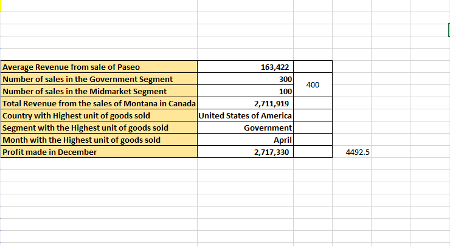

# ADVANCED EXCEL FORMULAS AND FUNCTIONS 
# **Introduction**
This tasks is aimed towards the mastery of Excel's advanced formulas and functions.
## Concept Demonstrated
- VLOOKUP FUNCTION, COUNTIF FUNCTION, AVERAGEIF FUNCTION, SUMIFS FUNCTION AND SUMIF FUNCTION.
## Problem Statement
## 1. The Average revenue generated from each sales of Paseo.
- To get this,the "AVERAGEIF FUNCTION" is used and it gives "163,422"
## 2. The number of sales generated from the government and midmarket segment,
- To get this,the "COUNTIF FUNCTION" is used and it gives "400"
## 3.The total revenue generated from the sales of "Montana" in Canada,
- To get this,the "SUMIFS FUNCTION" is used and it gives "2,711,919.03"
## 4.In which country,month and segment was the highest unit of goods sold,
- To get this, the "VLOOKUP FUNCTION" is used and it gives "United States of America" as the "Country" with the highest unit of goods sold, while "Government" as the "Segment" with the highest unit of goods sold and "April" as the "Month" with the highest unit of goods sold
## 5.The total profit made in the month of December,
- To get this, the "SUMIF FUNCTION" is used and it gives "2,717,330"
# The snipshot below shows the table 

## Conclusion
This task focuses on the use of Excel's advanced formulas and functions which was employed to solve the problem and got answers to the problems above
